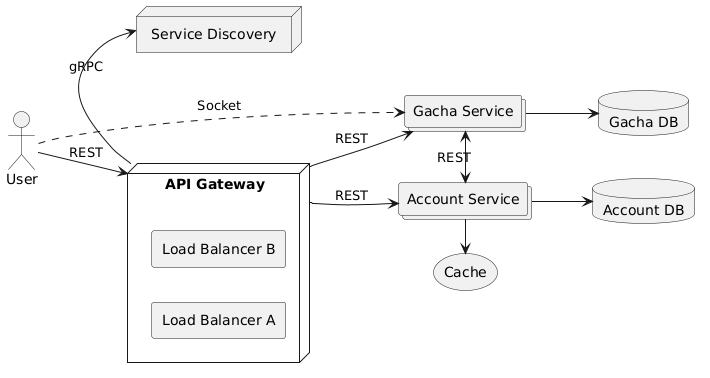

# Simulating a live-service game with a randomized reward system and microtransactions
A gacha system where you can obtain heroes or items by spending currency on a "banner" that represents an item pool. Complete with an account system where you can spend to buy said currency.

## Application Suitability

Microservices are ideal for complex applications with diverse features that benefit from independent development and scaling. A video game with microtransactions and randomized loot systems is a strong candidate for microservices due to the following reasons:

1. **Complexity**: The game has multiple components (gameplay, microtransactions, inventory) that can be developed and maintained separately.
2. **Scalability**: Microservices allow for independent scaling, ensuring services like microtransactions or game sessions can handle traffic surges without affecting other systems.
3. **Fault Isolation**: If one service fails (e.g., transactions), others (e.g., gameplay) remain functional.
4. **Independent Deployment**: Teams can update services (like loot mechanics) independently, reducing system-wide downtime.
5. **Technology Flexibility**: Different services can use different technologies suited to their needs, enhancing performance.

### Real-World Example

**Genshin Impact** (miHoYo) as a gacha game,  it uses microservices to handle randomized loot mechanics, player progression, and in-game purchases, scaling these systems separately for millions of users. Example Services: randomized loot/gacha pull service, player progress and inventory service, payment and transaction service.

## Service Boundaries

- Account service - responsible for authentication and procuring currency.
- Gacha service - responsible for randomized reward system as well as the socket connection through which a user can choose a specific pool of items which they could get.



## Technology Stack and Communication Patterns
- API Gateway: ExpressJS, NodeJS
- Service Discovery: Javascript
- Services: Python, Flask
- Cache: Redis
- Databases: PostgreSQL
- Authentication: JWT

The Gateway and Service discovery will communicate via gRPC, the rest will use REST APIs for information exchange.

**Task timeouts** can be implement by setting a maximum execution time for each request using `asyncio` in Python , and enforce **concurrent task limits** by using worker queues to control the number of tasks running simultaneously.

Load Balancing can be implemented using a simple counter to cycle through a list of server addresses. Each incoming request is directed to the next server in the list

## Data Management
Each service will have its own database and use REST APIs for data access.

### 1. **Account Service Endpoints**
#### 1.1 **User Registration Endpoint**
- **Endpoint**: `/account/register`
- **Method**: `POST`
- **Description**: Registers a new user.
- **Request Data**:
  ```json
  {
    "username": "string",
    "password": "string",
    "email": "string"
  }
  ```
- **Response**:
  ```json
  {
    "message": "User registered successfully",
    "userId": "string"
  }
  ```

#### 1.2 **User Authentication Endpoint (Login & Token Generation)**
- **Endpoint**: `/account/login`
- **Method**: `POST`
- **Description**: Authenticates the user and returns a JWT token.
- **Request Data**:
  ```json
  {
    "username": "string",
    "password": "string"
  }
  ```
- **Response**:
  ```json
  {
    "message": "Login successful",
    "token": "string"  // JWT token
  }
  ```

#### 1.3 **Buy Currency Endpoint (Protected)**
- **Endpoint**: `/account/buy-currency`
- **Method**: `POST`
- **Description**: Buys in-game currency for the authenticated user.
- **Headers**:
  ```json
  {
    "Authorization": "Bearer <JWT_TOKEN>"
  }
  ```
- **Request Data**:
  ```json
  {
    "amount": "integer",  // Amount of currency to buy
    "paymentMethod": "string"
  }
  ```
- **Response**:
  ```json
  {
    "message": "Currency purchased successfully",
    "newBalance": "integer"
  }
  ```

#### 1.4 **Retrieve Current Currency Amount Endpoint (Protected)**
- **Endpoint**: `/account/currency`
- **Method**: `GET`
- **Description**: Retrieves the current amount of currency for the authenticated user.
- **Headers**:
  ```json
  {
    "Authorization": "Bearer <JWT_TOKEN>"
  }
  ```
- **Response**:
  ```json
  {
    "userId": "string",
    "currencyBalance": "integer"
  }
  ```

### 2. **Gacha Service Endpoints**

#### 2.1 **Retrieve List of Available Items Endpoint**
- **Endpoint**: `/gacha/items`
- **Method**: `GET`
- **Description**: Retrieves a list of all available heroes or items in the gacha system.
- **Request Data**: None
- **Response**:
  ```json
  {
    "items": [
      {
        "id": "string",
        "name": "string",
        "type": "string",  // "hero" or "item"
        "rarity": "string"  // "rare", "super rare", "ultra rare"
      }
    ]
  }
  ```

#### 2.2 **Retrieve Rarity Chances Endpoint**
- **Endpoint**: `/gacha/rarity-chances`
- **Method**: `GET`
- **Description**: Retrieves the chance of obtaining each rarity.
- **Request Data**: None
- **Response**:
  ```json
  {
    "chances": {
      "rare": "float",  // Probability as a percentage
      "super_rare": "float",
      "ultra_rare": "float"
    }
  }
  ```

#### 2.3 **Consume Currency to Get Randomized Hero/Item (Protected)**
- **Endpoint**: `/gacha/pull`
- **Method**: `POST`
- **Description**: Uses currency to perform a gacha pull and returns a random hero or item based on rarity.
- **Headers**:
  ```json
  {
    "Authorization": "Bearer <JWT_TOKEN>"
  }
  ```
- **Request Data**:
  ```json
  {
    "currencySpent": "integer"
  }
  ```
- **Response**:
  ```json
  {
    "message": "Pull successful",
    "item": {
      "id": "string",
      "name": "string",
      "type": "string",  // "hero" or "item"
      "rarity": "string"  // "rare", "super rare", "ultra rare"
    },
    "newCurrencyBalance": "integer"
  }
  ```

#### 2.4 **Retrieve Gacha Pull History (Protected)**
- **Endpoint**: `/gacha/history`
- **Method**: `GET`
- **Description**: Retrieves the gacha pull history for the authenticated user.
- **Headers**:
  ```json
  {
    "Authorization": "Bearer <JWT_TOKEN>"
  }
  ```
- **Request Data**: None (User is identified via the JWT)
  
- **Response**:
  ```json
  {
    "userId": "string",
    "pulls": [
      {
        "pullId": "string",  // Unique ID for the pull event
        "item": {
          "id": "string",
          "name": "string",
          "type": "string",  // "hero" or "item"
          "rarity": "string"  // "rare", "super rare", "ultra rare"
        },
        "pulledAt": "string",  // Timestamp of the pull event
        "currencySpent": "integer"
      }
    ]
  }
  ```

## Deployment and Scaling
Deployment is going to be achieved by creating containers with Docker and using Docker compose for management and scaling.