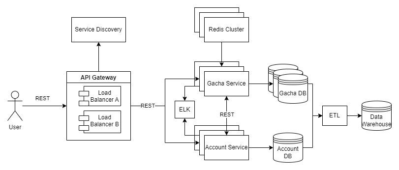

# Simulating a live-service game with a randomized reward system and microtransactions
A gacha system where you can obtain heroes or items by spending currency on a "banner" that represents an item pool. Complete with an account system where you can spend to buy said currency.

## Application Suitability

Microservices are ideal for complex applications with diverse features that benefit from independent development and scaling. A video game with microtransactions and randomized loot systems is a strong candidate for microservices due to the following reasons:

1. **Complexity**: The game has multiple components (gameplay, microtransactions, inventory) that can be developed and maintained separately.
2. **Scalability**: Microservices allow for independent scaling, ensuring services like microtransactions or game sessions can handle traffic surges without affecting other systems.
3. **Fault Isolation**: If one service fails (e.g., transactions), others (e.g., gameplay) remain functional.
4. **Independent Deployment**: Teams can update services (like loot mechanics) independently, reducing system-wide downtime.
5. **Technology Flexibility**: Different services can use different technologies suited to their needs, enhancing performance.

### Real-World Example

**Genshin Impact** (miHoYo) as a gacha game,  it uses microservices to handle randomized loot mechanics, player progression, and in-game purchases, scaling these systems separately for millions of users. Example Services: randomized loot/gacha pull service, player progress and inventory service, payment and transaction service.

## Service Boundaries

- Account service - responsible for authentication and procuring currency.
- Gacha service - responsible for randomized reward system.



## Technology Stack and Communication Patterns
- API Gateway: ExpressJS, NodeJS
- Service Discovery: Javascript
- Services: Python, Flask
- Cache: Redis
- Databases: PostgreSQL
- Authentication: JWT

The Gateway and Service discovery will communicate via gRPC, the rest will use REST APIs for information exchange.

**Task timeouts** can be implemented by setting a maximum execution time for each request using `asyncio` in Python , and enforce **concurrent task limits** by using worker queues to control the number of tasks running simultaneously.

Load Balancing can be implemented using a simple counter to cycle through a list of server addresses. Each incoming request is directed to the next server in the list

## Data Management
Each service will have its own database and use REST APIs for data access.

## Lab 2
1. **Circuit Breaker with Failover Mechanism**:
   - Retry a request up to 3 times before switching to another service instance.
   - Show error only when all services are unavailable.
2. **Service High Availability**:
   + Elimination of single points of failure. This means adding or building redundancy into the system so that failure of a component does not mean failure of the entire system.
   * Reliable crossover. In redundant systems, the crossover point itself tends to become a single point of failure. Reliable systems must provide for reliable crossover.
   + Detection of failures as they occur. If the two principles above are observed, then a user may never see a failure – but the maintenance activity must.
3. **ELK Stack or Prometheus + Grafana for Logging** (whichever is easier to set-up):
   - ELK Stack (Elasticsearch, Logstash, Kibana) or Prometheus + Grafana for aggregating logs and metrics from all services.
   - Provides centralized logging, real-time metrics, and alerting.

4. **Microservice-based 2-Phase Commit**:
   - 2-Phase Commit: Ensures atomicity across multiple microservices (databases) by committing changes in two phases.
   - Long-running saga transactions: As an alternative to 2PC, using a saga pattern with a coordinator to manage long transactions across services.

5. **Consistent Hashing for Cache**:
   - Distribute cache data across multiple nodes using consistent hashing to reduce cache reorganization.
   - Done using Redis Clusters.

6. **Database Redundancy/Replication with Failover**:
   - Using database replication techniques (PostgreSQL master-slave replication) to create multiple replicas.
   - Automatic failover to secondary database instances in case of primary database failure.
   - Minimum 3 replicas for redundancy.

7. **Data Warehouse and ETL**:
   - ETL (Extract, Transform, Load): Implement periodic ETL processes to aggregate data from various services' databases into a Data Warehouse for analytics and reporting.

These technologies and techniques ensure the system is fault-tolerant, scalable, and efficient, with improved monitoring, high availability, and data integrity across microservices.
## Endpoints
### 0. **Initialize gacha database endpoint**
- **Endpoint**: `/initdb`
- **Method**: `GET`
- **Description**: Introduces items into the gacha db to be able to perform pulls.
### 1. **Account Service Endpoints**
#### 1.1 **User Registration Endpoint**
- **Endpoint**: `/register`
- **Method**: `POST`
- **Description**: Registers a new user.
- **Request Data**:
  ```json
  {
    "username": "string",
    "password": "string",
    "email": "string"
  }
  ```
- **Response**:
  ```json
  {
    "message": "User registered successfully",
    "userId": "string"
  }
  ```

#### 1.2 **User Authentication Endpoint (Login & Token Generation)**
- **Endpoint**: `/login`
- **Method**: `POST`
- **Description**: Authenticates the user and returns a JWT token.
- **Request Data**:
  ```json
  {
    "username": "string",
    "password": "string"
  }
  ```
- **Response**:
  ```json
  {
    "message": "Login successful",
    "token": "string"  // JWT token
  }
  ```

#### 1.3 **Buy Currency Endpoint (Protected)**
- **Endpoint**: `/buy-currency`
- **Method**: `POST`
- **Description**: Buys in-game currency for the authenticated user.
- **Headers**:
  ```json
  {
    "Authorization": "Bearer <JWT_TOKEN>"
  }
  ```
- **Request Data**:
  ```json
  {
    "amount": "integer",  // Amount of currency to buy
    "paymentMethod": "string"
  }
  ```
- **Response**:
  ```json
  {
    "message": "Currency purchased successfully",
    "newBalance": "integer"
  }
  ```

#### 1.4 **Retrieve Current Currency Amount Endpoint (Protected)**
- **Endpoint**: `/currency`
- **Method**: `GET`
- **Description**: Retrieves the current amount of currency for the authenticated user.
- **Headers**:
  ```json
  {
    "Authorization": "Bearer <JWT_TOKEN>"
  }
  ```
- **Response**:
  ```json
  {
    "userId": "string",
    "currencyBalance": "integer"
  }
  ```

### 2. **Gacha Service Endpoints**

#### 2.1 **Retrieve List of Available Items Endpoint**
- **Endpoint**: `/items`
- **Method**: `GET`
- **Description**: Retrieves a list of all available heroes or items in the gacha system.
- **Request Data**: None
- **Response**:
  ```json
  {
    "items": [
      {
        "id": "string",
        "name": "string",
        "rarity": "string"  // "rare", "super rare", "ultra rare"
      }
    ]
  }
  ```

#### 2.2 **Retrieve Rarity Chances Endpoint**
- **Endpoint**: `/chances`
- **Method**: `GET`
- **Description**: Retrieves the chance of obtaining each rarity.
- **Request Data**: None
- **Response**:
  ```json
  {
    "chances": {
      "rare": "float",  // Probability as a percentage
      "super_rare": "float",
      "ultra_rare": "float"
    }
  }
  ```

#### 2.3 **Consume Currency to Get Randomized Hero/Item Endpoint (Protected)**
- **Endpoint**: `/gacha/pull/{id}`
- **Method**: `GET`
- **Description**: Allows users to select a specific banner by its ID and pull a randomized hero or item from that banner.
- **Headers**:
  ```json
  {
    "Authorization": "Bearer <JWT_TOKEN>"
  }
  ```
- **Response**:
```json
{
    "pulled_items": [
        { "item_id": 1, "name": "Sword", "rarity": "Rare" },
        { "item_id": 2, "name": "Shield", "rarity": "Epic" }
    ]
}
```
If an error occurs (e.g., insufficient currency), the server can return:

```json
{
  "status": "error",
  "message": "Insufficient currency"
}
```

## Deployment 
#### Requirements
Git and Docker.
1. **Clone the Repository**  
   Start by cloning this repository to your local machine.
   ```bash
   git clone https://github.com/BuzuAlexandru/PAD.git
   cd <repo-dir>
   ```

2. **Build and Run Containers**  
   Use Docker Compose to build and start the application services.
   ```bash
   docker-compose up --build
   ```
3. **Accessing the Application**  
   Once the containers are up and running, you can access the Postman collection to test the application.

4. **Stopping the Services**  
   To stop the running containers:
   ```bash
   docker-compose down